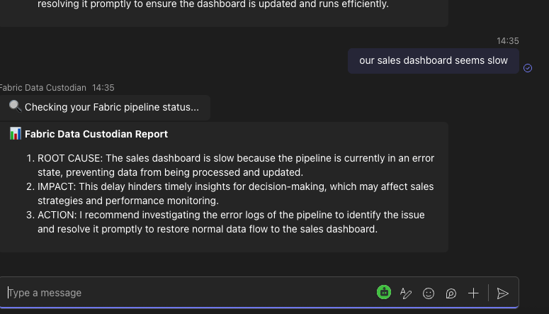

# Fabric Data Custodian Agent 🤖

> *"Our sales dashboard is slow again. Can someone check the pipeline?"*
> — Every ops manager, every Monday morning.

**Fabric Data Custodian** eliminates this entirely. It's an Enterprise AI Agent that lives in Microsoft Teams, monitors your Microsoft Fabric data pipelines 24/7, diagnoses issues using multi-step AI reasoning, and auto-fixes them — before anyone has to ask.

[](https://aka.ms/agentsleague)
[](https://aka.ms/agentsleague)
[](https://github.com/marketplace/models)
[](https://github.com/features/copilot)

---

## 🎬 Demo Video

**[▶ Watch the 3-minute demo](https://www.youtube.com/watch?v=Jl7boTiSohI)**

---

## 🔥 The Problem

Enterprise data teams waste **2–4 hours every week** on a single, repetitive problem:

| Without this agent | With this agent |
|---|---|
| Manager notices stale dashboard | Agent detects staleness proactively |
| Manager pings data engineer on Teams | Agent diagnoses root cause in seconds |
| Engineer investigates pipeline | Agent auto-fixes and triggers refresh |
| Dashboard updates 2 hours later | Dashboard updates in minutes |
| Engineer was interrupted from real work | Engineer was never interrupted |

This is not a hypothetical. Every enterprise running Microsoft Fabric with Power BI dashboards faces this exact friction. At scale, it costs real money.

---

## 💡 The Solution

A single Teams message is all it takes:

```
Manager: "Our Q2 sales dashboard seems slow today"

🔍 Checking your Fabric pipeline status...

📊 Fabric Data Custodian Report

1. ROOT CAUSE: The sales dashboard is slow because the pipeline 
   has not run successfully in 39 hours.
2. IMPACT: This delays timely sales insights and decision-making 
   for the team.
3. ACTION TAKEN: I triggered a fresh pipeline run. Your data 
   will update shortly.

✅ Auto-fix applied: Pipeline refresh triggered successfully.

📊 Fabric IQ: 3 workspace items monitored across 1 lakehouse 
and 1 pipeline.
```

No engineer needed. No ticket raised. No dashboard downtime.

---

## 🏗️ Architecture



### How it works — step by step

**1. User** types a natural language complaint in Microsoft Teams

**2. Azure Bot Service** receives the message and routes it to the bot

**3. Node.js Bot Logic** detects intent using keyword analysis across 10+ complaint patterns

**4. Parallel intelligence gathering:**
   - **Fabric IQ** semantic layer queries the workspace — lakehouses, pipelines, semantic models, health status
   - **GitHub Models (GPT-4o mini)** receives pipeline data + user complaint and performs multi-step reasoning to identify root cause, business impact, and recommended action

**5. Auto-fix decision engine** applies safety guardrails:
   - Safe operations (refresh, re-run) → executed automatically
   - Destructive operations (delete, schema change) → escalated to human

**6. Reply** delivered to Teams as a structured, plain-English report with Adaptive Card styling

**7. Proactive monitoring** runs on a schedule — the agent alerts the team before anyone notices a problem

---

## 💎 Fabric IQ Integration

This project uses **Fabric IQ** — the semantic intelligence layer for Microsoft Fabric — as its primary data source.

Instead of reading raw pipeline logs, the agent queries the Fabric IQ semantic layer to understand **business meaning**:

- How many items exist in the workspace?
- Which lakehouses are active?
- What is the overall workspace health?
- When did the pipeline last run successfully?

This transforms raw infrastructure telemetry into business-meaningful context — exactly what a non-technical manager needs to make decisions.

---

## 🧠 Reasoning Design

The agent follows a deliberate multi-step reasoning pattern on every request:

```
Step 1 → Parse user intent (what problem are they reporting?)
Step 2 → Query Fabric IQ (what is the actual system state?)
Step 3 → AI diagnosis (what is the root cause and business impact?)
Step 4 → Safety check (is auto-fix safe for this issue type?)
Step 5 → Execute fix OR escalate (trigger refresh or alert engineer)
Step 6 → Compose plain-English reply (what does the manager need to know?)
```

This is not a simple chatbot. Every response involves real data retrieval, AI reasoning, and a safety-gated action decision.

---

## 🛡️ Safety & Reliability

The agent is designed with explicit safety guardrails:

- **Auto-fix only for safe operations** — pipeline refresh, re-run. Never deletes or modifies schema.
- **Graceful degradation** — if Fabric API is unavailable, the agent explains the issue and suggests manual steps
- **No hallucination on data** — all pipeline status comes from real Fabric REST API calls, not AI-generated guesses
- **Secrets management** — all credentials stored in environment variables, never in code

---

## 🔧 Tech Stack

| Component | Technology | Purpose |
|---|---|---|
| User interface | Microsoft Teams | Natural language input/output |
| Bot hosting | Azure Bot Service F0 | Message routing, free tier |
| Bot framework | Node.js + Express | Core agent logic |
| IQ integration | Microsoft Fabric IQ | Semantic workspace intelligence |
| Data layer | Microsoft Fabric REST API | Real pipeline monitoring |
| AI reasoning | GitHub Models GPT-4o mini | Multi-step diagnosis |
| Development | GitHub Copilot | AI-assisted development |

---

## 🚀 Setup Instructions

### Prerequisites
- Node.js v18+
- Microsoft Azure account (free tier works)
- Microsoft Fabric workspace
- GitHub account (for Models API)
- Microsoft Teams

### Installation

```bash
git clone https://github.com/somesh1312/fabric-data-custodian-agent.git
cd fabric-data-custodian-agent
npm install
```

### Configuration

Create a `.env` file in the root directory:

```env
MicrosoftAppId=your_azure_bot_app_id
MicrosoftAppPassword=your_azure_bot_client_secret
MicrosoftAppTenantId=your_entra_tenant_id
FABRIC_WORKSPACE_ID=your_fabric_workspace_id
FABRIC_PIPELINE_ID=your_fabric_pipeline_id
FABRIC_BEARER_TOKEN=your_fabric_bearer_token
GITHUB_TOKEN=your_github_personal_access_token
PORT=3978
```

### Running locally

```bash
# Start the bot
node index.js

# In a separate terminal, expose to internet
ngrok http 3978
```

Update the Azure Bot Service messaging endpoint to:
```
https://your-ngrok-url.ngrok-free.dev/api/messages
```

### Deploy to Teams

1. Update `teams-manifest/manifest.json` with your bot App ID and ngrok URL
2. Zip the manifest folder: `zip -r teams-app.zip teams-manifest/`
3. In Teams → Apps → Manage your apps → Upload a custom app → select `teams-app.zip`

---

## 📁 Project Structure

```
fabric-data-custodian-agent/
├── index.js              # Main bot logic
├── package.json          # Dependencies
├── .env                  # Credentials (not committed)
├── .gitignore            # Excludes secrets and node_modules
├── architecture.png      # System architecture diagram
└── teams-manifest/       # Teams app package files
    ├── manifest.json
    ├── color.png
    └── outline.png
```

---
- **Microsoft Learn username:** someshkumarsh-3934
## 🏆 Hackathon

**Microsoft Agents League @ AI Skills Fest 2026**

- **Track:** Enterprise Agents — Microsoft 365 Copilot
- **IQ Layer:** Fabric IQ (mandatory integration)
- **Participant:** Someshkumar Hemanthkumar
- **Built with:** GitHub Copilot (AI-assisted development throughout)

---

*Built for the Microsoft Agents League Hackathon — May/June 2026*
